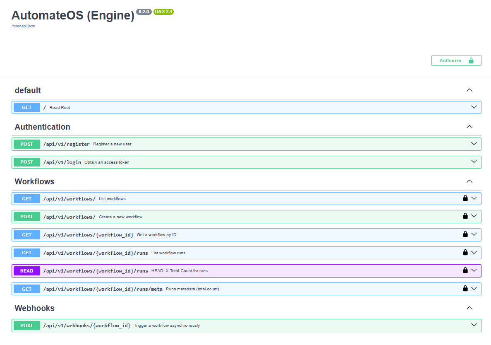
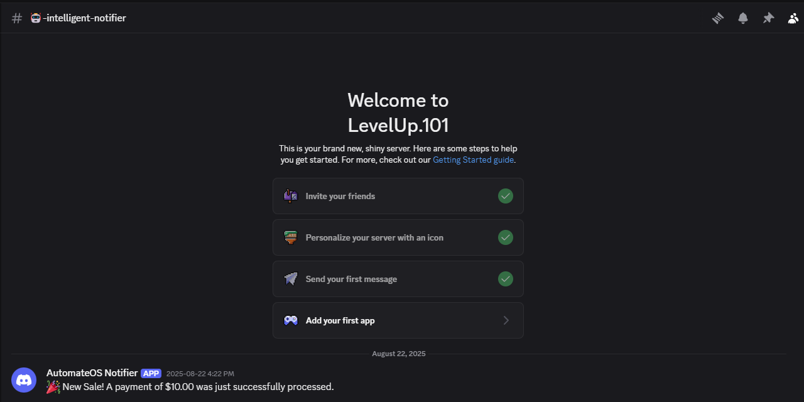
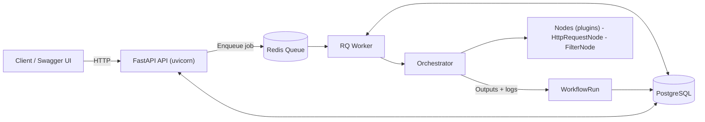

## AutomateOS Engine

Bold automations, simple building blocks.

### AutomateOS Engine: A lightweight, plugin‑driven workflow engine. Built to be extended.

A clear separation of concerns is at the heart of this design. With distinct layers for the API, engine, database models, and schemas, the codebase is easy to read, easy to change, and easy to scale.

At its core, the engine is a lean Orchestrator that dynamically loads and runs nodes. Compose small, focused nodes (like HTTP requests and filters) into powerful, reproducible workflows.

## Core features

-   Plugin architecture: add new nodes without touching the core
-   Asynchronous execution: API enqueues, worker executes (Redis + RQ)
-   Orchestrator runtime: executes a sequence of typed nodes with shared context
-   HTTP Request node: call external services with JSON payloads
-   Filtering and control flow: chain nodes and inspect results
-   Persistence: PostgreSQL in Docker; SQLite fallback for local dev
-   History API: list workflow runs and statuses, newest first
-   Auth built‑in: register/login and Bearer JWT for protected routes

## Getting started (Docker)

Everything is pre‑wired: API, worker, Redis, and PostgreSQL.

Prerequisites

-   Docker Desktop (Windows/macOS/Linux)

Quick start

```powershell
docker compose up -d --build
```

Open the API docs at http://localhost:8000/docs

Useful commands

```powershell
docker compose logs -f api
docker compose logs -f worker
docker compose down
```

Container environment

-   DATABASE_URL=postgresql+psycopg2://automateos:automateos@db:5432/automateos_db
-   REDIS_URL=redis://redis:6379/0

### What you’ll see in the docs



### Run an example workflow (from Swagger UI)

1. Authorize: POST /api/v1/login (form):

    - username: your email
    - password: your password
      Copy the access_token, click Authorize (Bearer) in the top‑right.

2. Create a workflow: POST /api/v1/workflows with this body (replace url with your Discord webhook):

```json
{
    "name": "Stripe to Discord Bridge",
    "definition": {
        "steps": [
            {
                "type": "http_request_node",
                "config": {
                    "method": "POST",
                    "url": "https://discord.com/api/webhooks/xxx/yyy",
                    "headers": { "Content-Type": "application/json" },
                    "json_body": {
                        "content": "🎉 New Sale! A payment of $10.00 was just successfully processed."
                    }
                }
            }
        ]
    }
}
```

3. Trigger it: POST /api/v1/webhooks/{workflow_id}

4. Check status: GET /api/v1/workflows/{workflow_id}/runs?limit=1

### Test result

Successful run sending a Discord message via webhook:



## Local development (Windows)

Local dev defaults to SQLite and a local Redis unless you set env vars.

Install dependencies

```powershell
pip install -r .\requirement.txt
```

Run API and worker

```powershell
uvicorn main:app --reload
python worker.py
```

To use Postgres locally, set DATABASE_URL and install libpq (or psycopg2‑binary). Otherwise stick with SQLite (default).

Configuration notes

-   Docker uses `requirements.txt` (includes psycopg2-binary)
-   Local dev uses `requirement.txt` (omits psycopg2-binary for Windows friendliness)
-   Code reads configuration from env:
    -   `DATABASE_URL` in `app/db/session.py` (falls back to a local SQLite file)
    -   `REDIS_URL` in `app/core/queue.py` and `worker.py` (falls back to `redis://localhost:6379/0`)

## Technology stack

-   FastAPI, Starlette
-   SQLModel, SQLAlchemy
-   PostgreSQL (Docker), SQLite (local fallback)
-   Redis + RQ (queue + worker)
-   Uvicorn
-   Docker & Docker Compose

## Architecture

High‑level flow of the engine:



Components

-   API: Receives requests, persists workflows, and enqueues jobs.
-   Redis: Lightweight queue for async handoff between API and worker.
-   Worker: Pulls jobs, executes workflows via the orchestrator.
-   Orchestrator: Runs nodes in sequence, passing context between them.
-   Nodes (plugins): Small, composable units (e.g., HTTP calls, filters).
-   Database: Stores workflows and their run history.

### \#\# Directory Tree

```
automateos/
├── .env                  # Environment variables (DB connection, secrets)
├── .gitignore            # Git ignore file
├── docker-compose.yml    # Orchestrates all services for development
├── Dockerfile            # Dockerfile for the FastAPI application
├── Dockerfile.worker     # Dockerfile for the RQ worker
├── README.md             # Project documentation
├── requirements.txt      # Python dependencies
├── main.py               # Entry point to run the FastAPI app
├── worker.py             # Entry point to run the RQ worker
│
├── app/                  # Main application source code
│   ├── __init__.py
│   │
│   ├── api/              # API endpoints (routers)
│   │   ├── __init__.py
│   │   └── v1/
│   │       ├── __init__.py
│   │       ├── api.py      # Aggregates all endpoint routers
│   │       └── endpoints/
│   │           ├── __init__.py
│   │           ├── auth.py
│   │           └── workflows.py
│   │
│   ├── core/             # Core logic: config, security
│   │   ├── __init__.py
│   │   ├── config.py
│   │   └── security.py
│   │
│   ├── db/               # Database session management
│   │   ├── __init__.py
│   │   └── session.py
│   │
│   ├── engine/           # The workflow execution engine (used by the worker)
│   │   ├── __init__.py
│   │   ├── orchestrator.py
│   │   └── nodes/        # The "Plugin" directory for all nodes
│   │       ├── __init__.py
│   │       ├── base.py
│   │       ├── http_request_node.py
│   │       └── filter_node.py
│   │
│   ├── models/           # SQLModel database models
│   │   ├── __init__.py
│   │   ├── user.py
│   │   └── workflow.py
│   │
│   └── schemas/          # Pydantic schemas for API validation
│       ├── __init__.py
│       ├── user.py
│       └── workflow.py
│
└── tests/                # Application tests
    ├── __init__.py
    └── ...
```

---

### \#\# Key Directory Explanations

-   **`automateos/` (Root):** Contains Docker files, environment configurations, and entry points (`main.py`, `worker.py`). This keeps runtime configuration separate from application logic.

-   **`app/`:** The main Python package for application source code.

-   **`app/api/`:** Holds all API versions and endpoints. Starting with a `v1/` sub-directory that makes future API updates much easier.

-   **`app/core/`:** For application-wide logic like loading configuration from `.env` files (`config.py`) and handling security tasks like password hashing and JWT management (`security.py`).

-   **`app/engine/`:** This is the heart of automation logic. It's used by `worker.py` but not directly by the API.

    -   `orchestrator.py`: The main file that contains the logic to run a workflow step-by-step.
    -   `nodes/`: Your **plugin directory**. You simply add a new Python file here to create a new node, and the engine will dynamically load it.

-   **`app/models/`:** Contains SQLModel classes, which define database table structures.

-   **`app/schemas/`:** Contains Pydantic classes. These define the shape of data for API. This separation from `models` allows you to expose different data in your API than what you store in your database.
